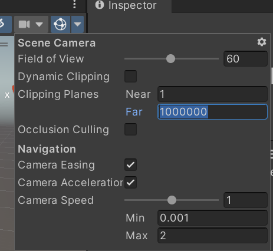

## Prerequisites

* CMake v3.15 or later
* [.NET SDK v7.0.100-preview.7 or later](https://dotnet.microsoft.com/en-us/download/dotnet/7.0)
* If you're using Visual Studio, you need Visual Studio 2022 v17.2 or later. The original release of Visual Studio 2022 is too old, so make sure yours has been updated.
* Unity 2021.3.2f1 (newer versions are likely to work)

The built Cesium for Unity assembly will run on much older versions of .NET, including the version of Mono included in Unity. However, these very recent versions are required for the C#<->C++ interop code generator (Reinterop).

To make sure things are set up correctly, open a command-prompt (PowerShell is a good choice on Windows) and run:

* `dotnet --version` and verify that it reports 7.0 or later
* `cmake --version` and verify that it reports 3.15 or later

## Setting up the development environment

Clone the `cesium-unity-samples` (game) project and `cesium-unity` (plugin) project anywhere you like:

```
git clone --recurse-submodules git@github.com:CesiumGS/cesium-unity-samples.git
git clone --recurse-submodules git@github.com:CesiumGS/cesium-unity.git
```

Be sure to also clone the submodules. If you forgot the `--recurse-submodules` option when you cloned, run `git submodule update --init --recursive`.

Create a directory junction (symbol link) from the game project's Assets directory into the plugin's Assets directory. On Windows 11, this should just work. On Windows 10, you may need to enable "Developer Mode" and/or use an Administrator command prompt. If you've put the two repos side-by-side as shown above, simply run the following in PowerShell:

```
cd cesium-unity
New-Item -ItemType Junction -Path "..\cesium-unity-samples\Assets\CesiumForUnity" -Target ".\Assets"
```

To setup the symbolic link in Mac or Linux:

```
cd cesium-unity-samples/Assets/
ln -s ../../cesium-unity/Assets CesiumForUnity
```

Unity only loads assets found in the game's Assets folder. By using a symlink, we keep the plugin's assets in the plugin's repo, making them much easier to manage with source control.

## Building

Before you begin, check that the HintPaths in [CesiumForUnity.csproj](CesiumForUnity/CesiumForUnity.csproj) are correct for your platform and version of Unity. On Mac, for instance, the UnityEngine.dll HintPath is:
`/Applications/Unity/Hub/Editor/2021.3.2f1/Unity.app/Contents/Managed/UnityEngine.dll`

Building Cesium for Unity requires building both an Editor and a non-Editor (i.e. built game) configuration, and each configuration has both a C# and a C++ part. So there are a totally of four projects, and all must be built before you can run Cesium for Unity.

The C# code must be compiled first, because its compilation process generates some code that is needed by the C++ build. To build the C# code for the non-Editor configuration, run the following in the root `cesium-unity` directory:

```
dotnet publish CesiumForUnity -c Debug -p:Editor=False
```

Replace `Debug` with `Release` for a release build. The performance is significantly better with a Release build!

This will do the following:

* Compile the Cesium for Unity C# code.
* Generate (on the fly) some new C# code for interop with C++ and compile that in, too.
* Generate C++ header and source files for the C++ side of the interop.
* Copy the built DLLs and PDBs to the `Assets/NonEditor` directory.

To build the C++ code for the non-Editor configuration, run the following from the `cesium-unity` directory:

```
cmake -B build -S . -DEDITOR=false
cmake --build build --target install -j14 --config Debug
```

The `-j14` tells CMake to build using 14 threads. A higher or lower number may be more suitable for your system.

The CMake build will:

* Compile the DLL containing the C++ code.
* Copy the built DLLs and PDBs to the `Assets/NonEditor` directory.

Next, build the Editor configuration of both the C# and C++ code:

```
dotnet publish CesiumForUnity -c Debug -p:Editor=True
cmake -B build -S . -DEDITOR=true
cmake --build build --target install -j14 --config Debug
```

Unity requires that the binaries for the non-Editor configuration _exist_, otherwise Cesium for Unity won't work at all, even in the Editor. But once you've built it once, if you're working exclusively in the Editor, you can iterate by only building the Editor configuration. The non-Editor binaries must exist, but they need not be up-to-date unless you're planning to build a game to run outside the Editor.

## Running the Examples

The easiest way to get started is to open the [**cesium-unity-samples**](https://github.com/CesiumGS/cesium-unity-samples) project in the Unity Editor and see Cesium datasets being streamed in. The project has been set up with levels that allow you to quickly get running with Cesium for Unity.

## Adding Cesium for Unity to a new project

1. Cesium for Unity has only been tested with the Universal Render Pipeline (URP), so use that for best results. Others _may_ work.
2. To install Cesium for Unity into your project, build Cesium for Unity (as above) and then copy or symlink the Cesium for Unity `Assets` directory into your project's `Assets/CesiumForUnity` directory.
3. Change the Editor camera settings to accomodate globe-sized view distances. Disable "Dynamic Clipping" and set the near plane to 1 and the far plane to 1000000 (1 million). You may want to increase the maximum speed as well, to perhaps 200 or so.



4. Set the near and far planes for any cameras in your level as well.
5. Add a new empty GameObject to your scene and name it "Cesium".
6. Add a new `Cesium Georeference` component to the "Cesium" game object. By setting the Longitude, Latitude, and Height properties on this object, you define the position on the globe that becomes the center of the Unity world.
7. Add another new GameObject as a _child_ of the "Cesium" game object, and name it "Cesium World Terrain".
8. Add a new "Cesium 3D Tileset" component to the "Cesium World Terrain" game object and set the following properties:
  * Set the "Opaque Material" to "CesiumDefaultTilesetMaterial". This step will not be necessary in the future, but failing to do so at the moment may lead to a crash.
  * Set the "Ion Asset ID" to 1.
  * Set the "Ion Access Token" to a valid token for Cesium World Terrain from your Cesium ion account. At this point Cesium World Terrain should appear, but it will be all white.
9. Add a new "Cesium Ion Raster Overlay" component to the "Cesium World Terrain" game object and set the following properties:
  * Set the "Ion Asset ID" to 2.
  * Set the "Ion Access Token" to a valid Cesium ion token; the one from above is likely to work. At this point, the terrain surface should become textured.

## Running Cesium for Unity on Quest 2

1. Before building, make sure that there is an environment variable `ANDROID_NDK_ROOT` set as the path to the Android NDK. 
2. Next, build Cesium for Unity for Android with the following commands:

```
dotnet publish CesiumForUnity -c Debug -p:Editor=False
cmake -B build-android -S . -G Ninja -DCMAKE_TOOLCHAIN_FILE="CesiumForUnityNative/extern/android-toolchain.cmake" -DEDITOR=false
cmake --build build-android --target install -j14 --config Debug
```
3. Open the Cesium Unity Samples project with Unity version 2021.3.9f1 or higher. 
4. In the Unity Editor, change the settings of the project according to this page: https://developer.oculus.com/documentation/unity/unity-conf-settings/. 
5. Furthermore, in the Player settings, change the Graphics APIs list to only include Vulkan.
6. Click on `CesiumForUnity/NonEditor/libCesiumForUnityNative.so` and in the inspector, set the platform to Android and set CPU to ARM64.
7. With the Sample Scene open, go to GameObject > XR > Convert Main Camera To XR Rig.
8. Finally, select File > Build And Run to build an APK.

If you run into a crash on startup while using Vulkan, you may need to upgrade your version of Unity:
https://issuetracker.unity3d.com/issues/oculus-quest-app-using-vulkan-crashes-on-startup
