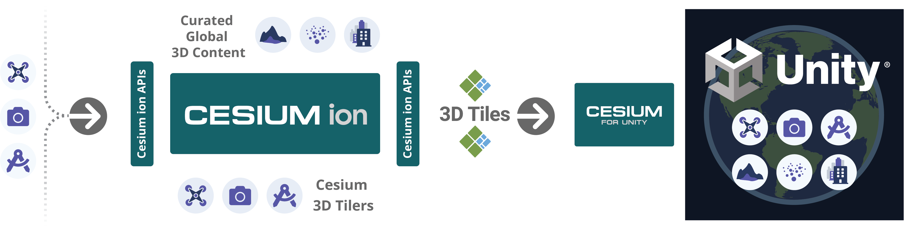

Cesium for Unity enables building 3D geospatial applications and experiences with 3D Tiles and open standards using Unity 3D. By combining a high-accuracy full-scale WGS84 globe, open APIs and open standards for spatial indexing such as 3D Tiles, and cloud-based real-world content from [Cesium ion](https://cesium.com/cesium-ion) with Unity, this plugin enables rich 3D geospatial workflows and applications in Unity.

[Cesium for Unity Homepage](https://cesium.com/platform/cesium-for-unity?utm_source=github&utm_medium=github&utm_campaign=unity)

### :rocket: Get Started

**[Download Cesium for Unity Samples](https://github.com/CesiumGS/cesium-unity-samples/releases/latest)**

**[Follow the Quickstart](https://cesium.com/learn/unity/unity-quickstart/)**

Have questions? Ask them on the [community forum](https://community.cesium.com/c/cesium-for-unity).

### :clap: Featured Demos

### :house_with_garden: Cesium for Unity and the 3D Geospatial Ecosystem

Cesium for Unity streams real-world 3D content such as high-resolution photogrammetry, terrain, imagery, and 3D buildings from [Cesium ion](https://cesium.com/cesium-ion) and other sources, available as optional commercial subscriptions. The plugin includes Cesium ion integration for instant access to global high-resolution 3D content ready for runtime streaming. Cesium ion users can also leverage cloud-based 3D tiling pipelines to create end-to-end workflows to transform massive heterogenous content into semantically-rich 3D Tiles, ready for streaming to Unity.

Cesium for Unity supports cloud and private network content and services based on open standards and APIs. You are free to use any combination of supported content sources, standards, APIs with Cesium for Unity.

Using Cesium ion helps support Cesium for Unity development. :heart:

### :chains: Unity Integration

Cesium for Unity is tightly integrated with Unity making it possible to visualize and interact with real-world content in editor and at runtime. The plugin also has support for Unity game objects, physics, collisions, and character interaction. Leverage decades worth of cutting-edge advancements in Unity and geospatial to create cohesive, interactive, and realistic simulations and applications with Cesium for Unity.

### :green_book: License

[Apache 2.0](http://www.apache.org/licenses/LICENSE-2.0.html). Cesium for Unity is free for both commercial and non-commercial use.

### :computer: Developing Cesium for Unity

See the [Developer Setup Guide](Documentation~/developer-setup.md) to learn how to set up a development environment for Cesium for Unity, allowing you to compile it, customize it, and contribute to its development.
