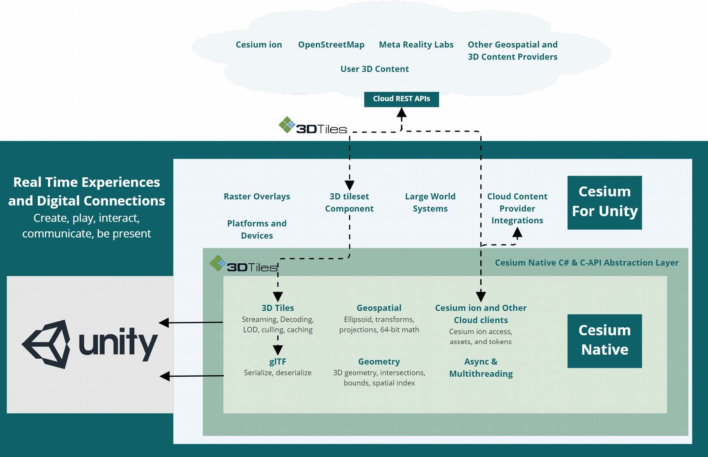
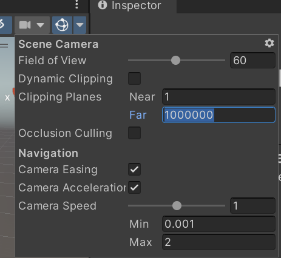

[](https://cesium.com/)

Cesium for Unity brings the 3D geospatial ecosystem to Unity. By combining a high-accuracy full-scale WGS84 globe, open APIs and open standards for spatial indexing such as 3D Tiles, and cloud-based real-world content from [Cesium ion](https://cesium.com/cesium-ion) with Unity, this plugin enables 3D geospatial workflows and applications in Unity.

### :rocket: Get Started

**[Download Cesium for Unity](https://github.com/CesiumGS/cesium-unity/releases)**

**[Follow the Quickstart](https://cesium.com/learn/unity/unity-quickstart/)**

Have questions? Ask them on the [community forum](https://community.cesium.com/c/cesium-for-unity).

### :clap: Featured Demos


### :house_with_garden: Cesium for Unity and the 3D Geospatial Ecosystem

Cesium for Unity streams real-world 3D content such as high-resolution photogrammetry, terrain, imagery, and 3D buildings from [Cesium ion](https://cesium.com/cesium-ion) and other sources, available as optional commercial subscriptions. The plugin includes Cesium ion integration for instant access to global high-resolution 3D content ready for runtime streaming. Cesium ion users can also leverage cloud-based 3D tiling pipelines to create end-to-end workflows to transform massive heterogenous content into semantically-rich 3D Tiles, ready for streaming to Unity.

Cesium for Unity supports cloud and private network content and services based on open standards and APIs. You are free to use any combination of supported content sources, standards, APIs with Cesium for Unity.



Using Cesium ion helps support Cesium for Unity development. :heart:

### :chains: Unity Integration

Cesium for Unity is tightly integrated with Unity making it possible to visualize and interact with real-world content in editor and at runtime. The plugin also has support for Unity physics, collisions, and character interaction. Leverage decades worth of cutting-edge advancements in Unity and geospatial to create cohesive, interactive, and realistic simulations and applications with Cesium for Unity.

### :green_book: License

[Apache 2.0](http://www.apache.org/licenses/LICENSE-2.0.html). Cesium for Unity is free for both commercial and non-commercial use.

### :computer: Developing Cesium for Unity

See the [Developer Setup Guide](Documentation~/developer-setup.md) to learn how to set up a development environment for Cesium for Unity, allowing you to compile it, customize it, and contribute to its development.

<!--
## :computer: Building Cesium for Unity

### Prerequisites

* CMake v3.15 or later
* [.NET SDK v7.0.100-preview.7 or later](https://dotnet.microsoft.com/en-us/download/dotnet/7.0)
* If you're using Visual Studio, you need Visual Studio 2022 v17.2 or later. The original release of Visual Studio 2022 is too old, so make sure yours has been updated.
* Unity 2021.3.2f1 (latest version of Unity 2021 LTS recommended)
* On Windows, support for long file paths must be enabled, or you are likely to see build errors. See [Maximum Path Length Limitation](https://learn.microsoft.com/en-us/windows/win32/fileio/maximum-file-path-limitation?tabs=registry#enable-long-paths-in-windows-10-version-1607-and-later).

The built Cesium for Unity Assembly will run on much older versions of .NET, including the version of Mono included in Unity. However, these very recent versions are required for the C#<->C++ interop code generator (Reinterop).

To make sure things are set up correctly, open a command-prompt (PowerShell is a good choice on Windows) and run:

* `dotnet --version` and verify that it reports 7.0 or later
* `cmake --version` and verify that it reports 3.15 or later

### Setting up the development environment

Clone the [`cesium-unity-samples`](https://github.com/CesiumGS/cesium-unity-samples) (game) project anywhere you like:

```
git clone --recurse-submodules git@github.com:CesiumGS/cesium-unity-samples.git
```

Then, clone the `cesium-unity` (plugin) project to a folder named `com.cesium.unity` inside its `Packages` folder:

```
cd cesium-unity-samples/Packages
git clone --recurse-submodules git@github.com:CesiumGS/cesium-unity.git com.cesium.unity
```

Be sure to also clone the submodules. If you forgot the `--recurse-submodules` option when you cloned, run `git submodule update --init --recursive` inside the `com.cesium.unity` folder.

## Reinterop

Reinterop is a Roslyn (C# compiler) source generator that is automatically invoked by Unity while compiling the Cesium for Unity C# code, and generates C# <-> C++ interop layer.

To build Reinterop and publish it to Cesium for Unity's `Assets` directory, run the following from the `Packages/com.cesium.unity` directory:

```
dotnet publish Reinterop~ -o .
```

This should be repeated if you modify Reinterop, or if you pull new changes that modify it.

## Build for the Editor

To start the Cesium for Unity build process, open the `cesium-unity-samples` project in the Unity Editor. Unity will automatically compile the Cesium for Unity C# source code, invoking Reinterop along the way to generate the C# and C++ source code.

At this point, you can open the sample scene and you will see GameObjects with Cesium3DTileset and other Cesium behaviors attached to them. However, the Cesium functionality will not actually work yet. Instead, you'll see errors like this in the console:

```
DllNotFoundException: CesiumForUnityNative assembly:<unknown assembly> type:<unknown type> member:(null)
NotImplementedException: The native implementation is missing so OnValidate cannot be invoked.
```

This is because the C++ code has not yet been compiled. To compile the C++ code for use in the Editor, run:

```
cd cesium-unity-samples/Packages/com.cesium.unity/native~
cmake -B build -S . -DCMAKE_BUILD_TYPE=Debug
cmake --build build -j14 --target install --config Debug
```

The `-j14` tells CMake to build using 14 threads. A higher or lower number may be more suitable for your system.

To build a release build, use these commands instead:

```
cd cesium-unity-samples/Packages/com.cesium.unity/native~
cmake -B build -S . -DCMAKE_BUILD_TYPE=RelWithDebInfo
cmake --build build -j14 --target install --config RelWithDebInfo
```

Once this build/install completes, Cesium for Unity should work the next time Unity loads Cesium for Unity. You can get it to do so by either restarting the Editor, or by making a small change to any Cesium for Unity script (.cs) file in `Packages/com.cesium.unity/Runtime`.

## Building and Running Games

When you build and run a standalone game (i.e. with File -> Build Settings... or File -> Build and Run in the Unity Editor), Unity will automatically compile Cesium for Unity for the target platform. Then, by hooking into Unity build events, Cesium for Unity will build the corresponding native code for that platform by running CMake on the command-line. This can take a few minutes, and during that time Unity's progress bar will display a message stating the location of the build log file.

You can view build progress on Windows using the following PowerShell command:

```
cd cesium-unity-samples/Packages/com.cesium.unity
Get-Content -Path native~/build-Standalone/build.log -Wait
```

Replace `build-Standalone` with the name of the log file from the progress window.

Or on Linux or macOS:

```
cd cesium-unity-samples/Packages/com.cesium.unity
tail -f native~/build-Standalone/build.log
```

If the log indicates that CMake cannot be found, make sure it is installed and in your path. Restarting Unity to pick up path changes may help. If all else fails, change `"cmake"` in `CompileCesiumForUnityNative.cs` to the full path of your CMake executable.

## Running the Samples

The cesium-unity-samples project has several scenes that help you to quickly get running with Cesium for Unity. Go to File -> Open Scene and navigate to the `Scenes` directory.

## Adding Cesium for Unity to a New Project

1. Cesium for Unity has only been tested with the Universal Render Pipeline (URP), so use that for best results. Others _may_ work.
2. To install Cesium for Unity into your project, clone the `cesium-unity` repo into your project's `Packages/com.cesium.unity` directory and build it as above.
3. Change the Editor camera settings to accomodate globe-sized view distances. Disable "Dynamic Clipping" and set the near plane to 1 and the far plane to 1000000 (1 million). You may want to increase the maximum speed as well, to perhaps 200 or so.
    
4. Set the near and far planes for any cameras in your level as well.
5. Add a new empty GameObject to your scene and name it "Cesium".
6. Add a new `Cesium Georeference` component to the "Cesium" game object. By setting the Longitude, Latitude, and Height properties on this object, you define the position on the globe that becomes the center of the Unity world.
7. Add another new GameObject as a _child_ of the "Cesium" game object, and name it "Cesium World Terrain".
8. Add a new "Cesium 3D Tileset" component to the "Cesium World Terrain" game object and set the following properties:
    * Set the "Opaque Material" to "CesiumDefaultTilesetMaterial". This step will not be necessary in the future, but failing to do so at the moment may lead to a crash.
    * Set the "Ion Asset ID" to 1.
    * Set the "Ion Access Token" to a valid token for Cesium World Terrain from your Cesium ion account. At this point Cesium World Terrain should appear, but it will be all white.
9. Add a new "Cesium Ion Raster Overlay" component to the "Cesium World Terrain" game object and set the following properties:
    * Set the "Ion Asset ID" to 2.
    * Set the "Ion Access Token" to a valid Cesium ion token; the one from above is likely to work. At this point, the terrain surface should become textured.

## :goggles: Running Cesium for Unity on Quest 2

1. Open the Cesium Unity Samples project.
2. Open the Quest 2 Demo scene.
3. Go to File -> Build Settings and change the platform to Android.
3. Also in the Build Settings, click Add Open Scenes and remove the original Sample Scene.
4. Go to Player Settings, and in XR Plug-in Management, go to the Android section and check OpenXR.
5. Finally, in the Build Settings, click Build And Run to build an APK.

## Packaging Cesium for Unity

To create a release package of Cesium for Unity, suitable to be installed with the Unity Package Manager, do the following (adjust the Unity path for your system):

```
$ENV:UNITY="C:\Program Files\Unity\Hub\Editor\2021.3.13f1\Editor\Unity.exe"
start -FilePath $ENV:UNITY -ArgumentList "-batchmode -quit -createProject c:\cesium\CesiumForUnityBuildProject" -wait
cd c:\cesium\CesiumForUnityBuildProject\Packages
git clone --recurse-submodules git@github.com:CesiumGS/cesium-unity.git com.cesium.unity
cd com.cesium.unity
dotnet publish Reinterop~ -o .
dotnet run --project Build~
```

On success, the built .tar.gz package is found in the root directory of the project (e.g. `c:\cesium\CesiumForUnityBuildProject`).

### :green_book:License

[Apache 2.0](http://www.apache.org/licenses/LICENSE-2.0.html). Cesium for Unity is free to use for both commercial and non-commercial use.

-->
